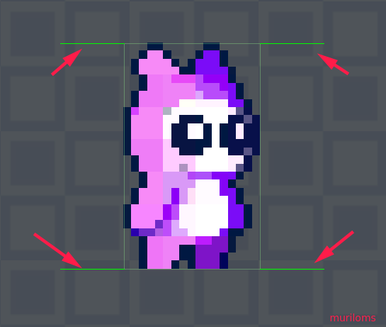

# Colisores
Existe diversos modos de trabalhar com colisores na Unity. Uma das principais é adicionar ao Game Object um Rigibody2D.

Um modo elegante onde o programador tem total controle sobre os parâmetros do Game Object é contruir o sistema de colisores com base no sistema RayCast. Nesse sistema são adicionados diversos sensores no Game Object para detectar as colisões e reagir de forma específica com cada colisão.
- [codigos](scripts/player/stage_01/)

