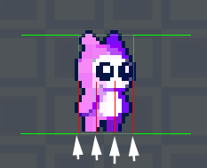
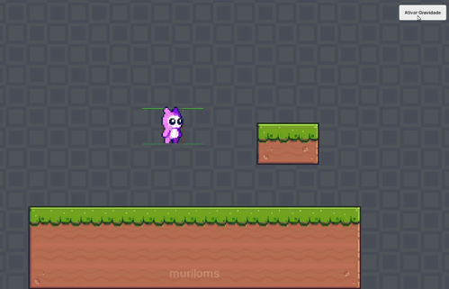

# Colisores
Existe diversos modos de trabalhar com colisores na Unity, sendo uma das principais adicionar ao Game Object um Rigibody2D.

Um modo elegante onde o programador tem total controle sobre os parâmetros do Game Object é contruir o sistema de colisores com base no sistema RayCast. Nesse sistema são adicionados diversos sensores no Game Object para detectar as colisões e reagir de forma específica com cada colisão.

## Definir limites
- [codigos](../scripts/player/stage_01/)

# Gravidade
## Implementar gravidade
Quando adiciona ao Game Object o Rigidbody2D, a física de gravidade é implementada. Como estamos utilizando sistema de colisão baseado no Raycast, precisamos implmentar a gravidade com os códigos.
- [codigos](../scripts/player/stage_02/)

# Colisores abaixo (Collision below)
Implementar colisores na região inferior do player com raycast. Necessário definir LayerMask para identificar qual layer o objecto de contato possui, reagindo de forma específica.
- [codigos](../scripts/player/stage_03/)

  

# Condições
Definir condições para os movimentos do player. Isso permite melhor controle do objeto e das animações.
- Está colidindo abaixo (Is Colliding Below )
- Está colidindo acima (Is Colliding Above )
- Está colidindo certo (Is Colliding Right)
- Está colidindo à esquerda (Is Colliding Left)
- Esta caindo (Is Falling)
- [codigos](../scripts/player/stage_04/)

# Estados
Definir um script para controlar os estados do player (andar, correr, pular, etc). Para cada estado criar um novo script referenciando o script controlador. Além disso, criar script motor para gerenciar a ativação dos estados
- [codigos](../scripts/player/stage_05/)
