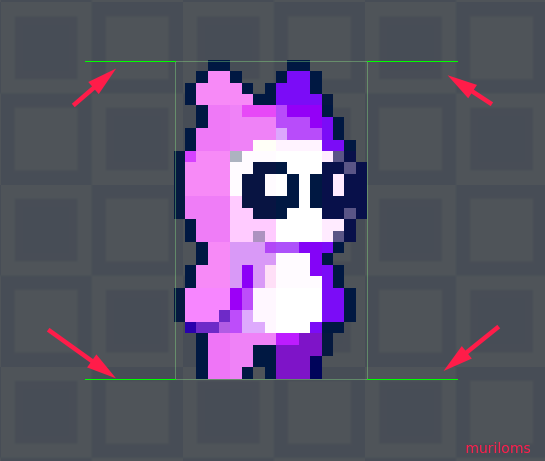
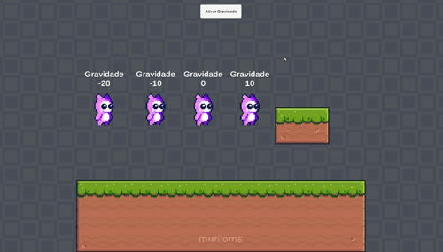

# Colisores
Existe diversos modos de trabalhar com colisores na Unity, sendo uma das principais adicionar ao Game Object um Rigibody2D.

Um modo elegante onde o programador tem total controle sobre os parâmetros do Game Object é contruir o sistema de colisores com base no sistema RayCast. Nesse sistema são adicionados diversos sensores no Game Object para detectar as colisões e reagir de forma específica com cada colisão.

## Definir limites
- [codigos](../scripts/player/stage_01/)

# Gravidade
## Implementar gravidade
Quando adiciona ao Game Object o Rigidbody2D, a física de gravidade é implementada. Como estamos utilizando sistema de colisão baseado no Raycast, precisamos implmentar a gravidade com os códigos.
- [codigos](../scripts/player/stage_02/)

